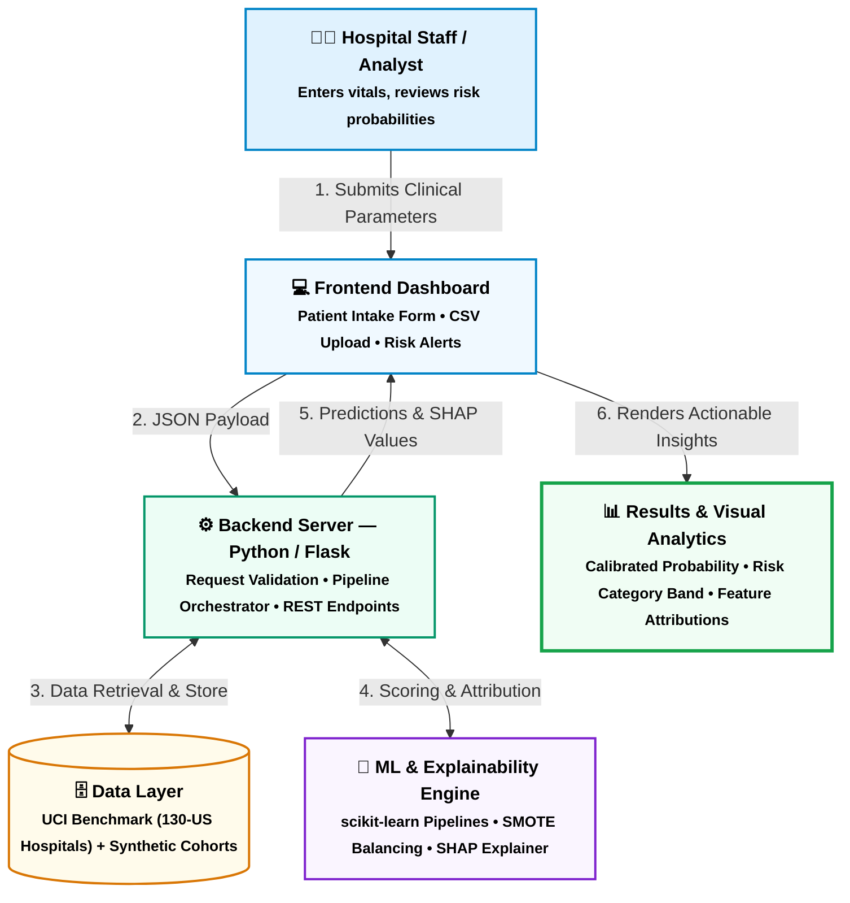
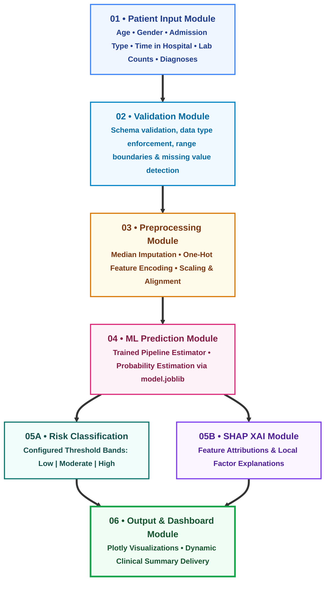
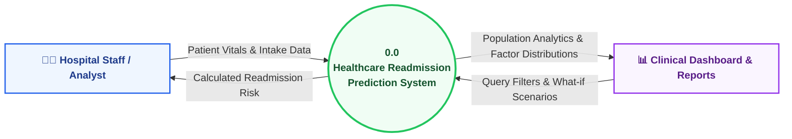
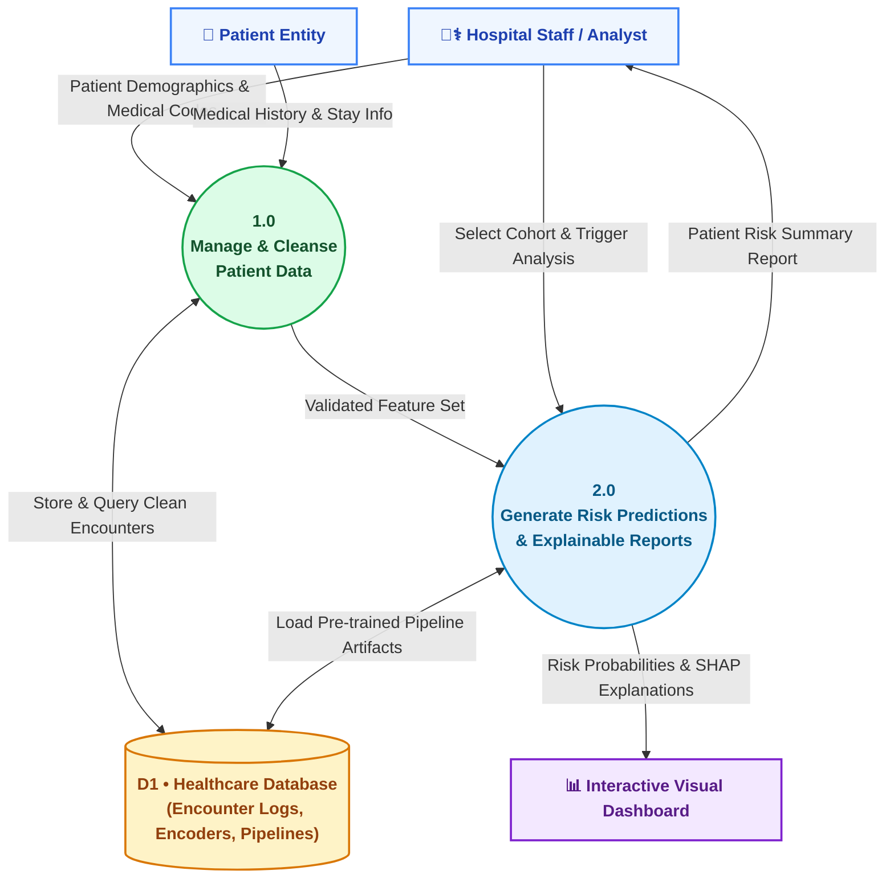

 <div align="center">

  <!-- Animated SVG Header Banner -->
  

  <br/>

  <!-- Matching Tagline -->
  <h2>🩺 Mastering Clinical Outcome Analytics</h2>
  <p><i>"Transforming EHR patterns into explainable, life-saving predictive care."</i></p>

  <!-- Color-Coded Metadata Badges (Matching reference style) -->
  <p>
    
    
    
    
  </p>

   
</div>

---

## 💡 Problem vs. Solution

<div align="center">

<table>
<tr>

<td width="48%" align="center" bgcolor="#EAF4FF">

<h3>❌ CURRENT PROBLEMS</h3>

<br>

🔴 <b>Undetected 30-Day Readmission Risk</b><br>
Patient readmission risk may remain unnoticed at discharge.

<br><br>

🔴 <b>Black-Box Predictions</b><br>
Risk predictions can lack clear explanations of contributing factors.

<br><br>

🔴 <b>Siloed Healthcare Data</b><br>
Limited visibility into population-level trends and patterns.

</td>

<td width="4%" align="center">

➡️

</td>

<td width="48%" align="center" bgcolor="#E8FAF4">

<h3>✅ OUR SOLUTION</h3>

<br>

🟢 <b>Risk Scoring</b><br>
Analyze patient data to identify readmission risk.

<br><br>

🟢 <b>Explainable Insights</b><br>
Highlight important factors contributing to patient risk.

<br><br>

🟢 <b>Interactive Analytics</b><br>
Visualize population trends, diagnosis patterns and outcomes.

</td>

</tr>
</table>

</div>

---

## 🎨 System Architecture (HLD & LLD)

Here is the full system architecture visual, colored with our presentation palette (**Teal, Sky Blue, Violet, Amber, and Emerald**).

### 🔷 High Level Design (HLD)


---

### 🔶 Low Level Design (LLD Modular Pipeline)


---

## 🔄 Data Flow Diagrams (DFD)

### 📌 DFD Level 0 — System Context View


---

### 📌 DFD Level 1 — Decomposed Data Routing


---

## 🛠️ Technology Stack Breakdown

<div align="center">

| Module | Technologies | Icon / Badge | Role in Project |
| :--- | :--- | :---: | :--- |
| **Backend Core** | Python 3.9+, Flask, Gunicorn |   | Lightweight REST API routing and prediction endpoints |
| **Data Engine** | Pandas, NumPy |   | Vectorized preprocessing, null imputation, and data cleaning |
| **ML Framework** | scikit-learn, joblib |  | Pipeline architecture, hyperparameter tuning & serialization |
| **Class Balancing** | imbalanced-learn (SMOTE) |  | Resolves 30-day readmission label skewness |
| **Explainable AI** | SHAP (SHapley Additive exPlanations) |  | Localized feature contribution attribution for clinicians |
| **Visual Analytics** | Plotly Express, HTML5, CSS3 |  | Interactive donut charts, gender splits, and risk gauges |

</div>

---

## ⚡ Quick Start & Setup

### 1. Clone the Repository
```bash
git clone https://github.com/srivastavanandani190-lang/Patient-Health-Outcome-Predictor.git
cd Patient-Health-Outcome-Predictor
```

### 2. Configure Virtual Environment
```bash
# Windows
python -m venv venv
.\venv\Scripts\activate

# macOS / Linux
python3 -m venv venv
source venv/bin/activate
```

### 3. Install Dependencies
```bash
pip install --upgrade pip
pip install -r requirements.txt
```

### 4. Launch the Web Application
```bash
python app.py
```
> Navigate to `http://127.0.0.1:5000` to interact with the prediction form and live analytics dashboard.

---

## 🛡️ Privacy, Ethics & Regulatory Compliance

* **HIPAA Safe Harbor:** Built strictly on de-identified and synthetic benchmark cohorts (UCI repository). No personally identifiable protected health information (PHI) is processed or stored.
* **Explainability by Design:** Rather than offering black-box risk probabilities, every recommendation features transparent clinical factor weights to aid clinician decision-making.

---

 

 
