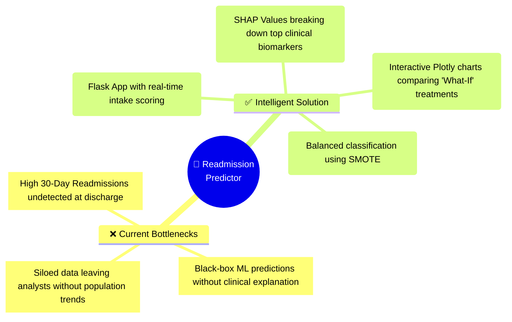
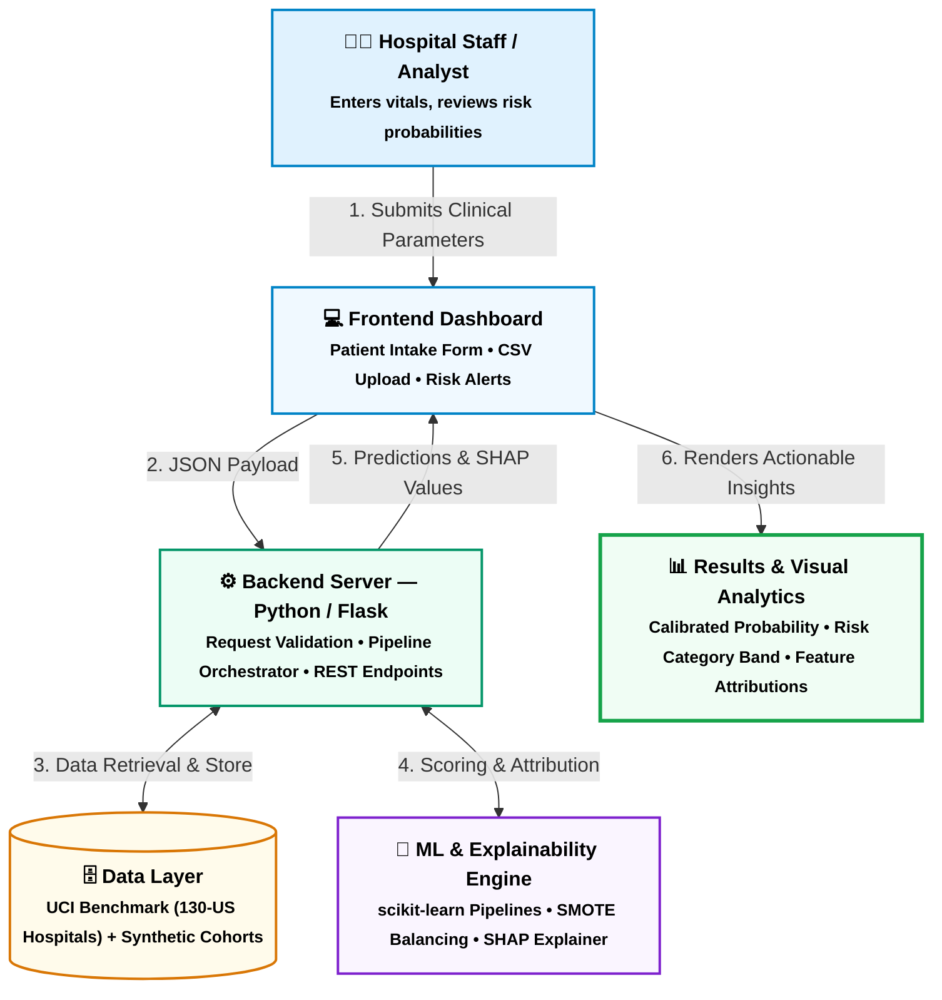
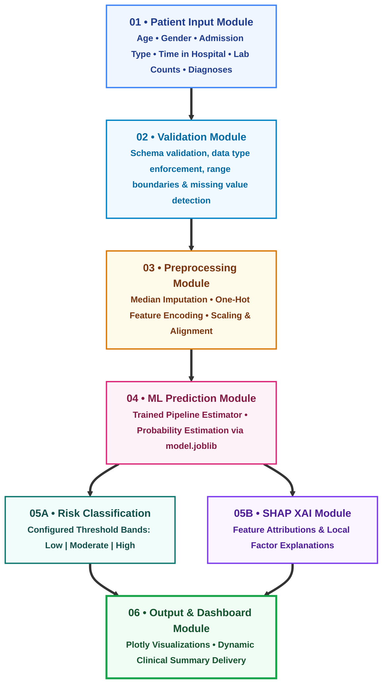
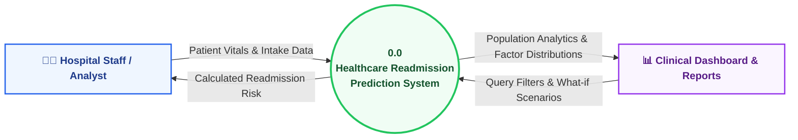
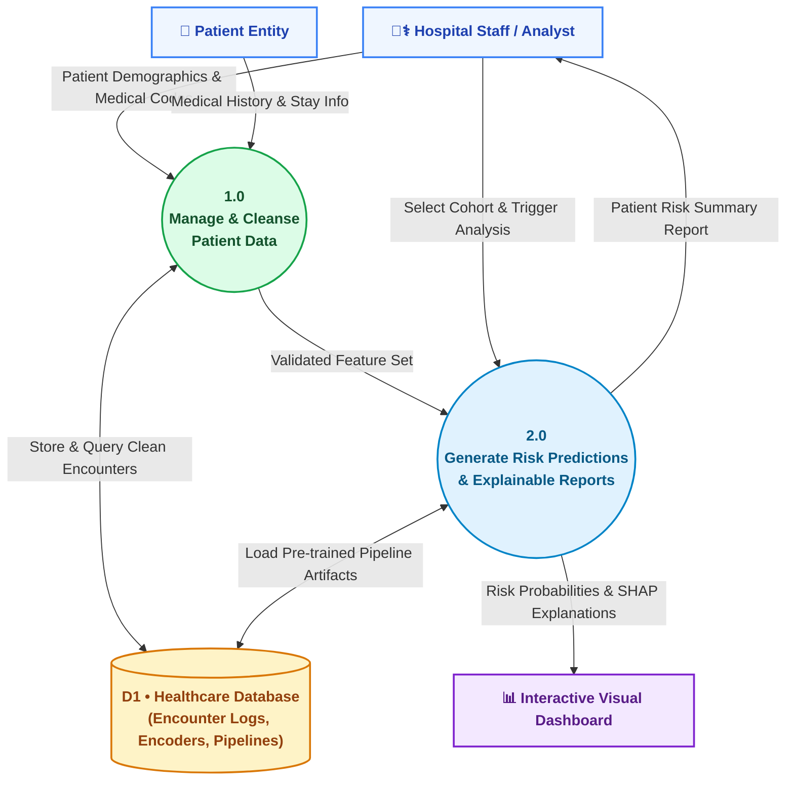

<div align="center">

<!-- Animated Header Banner SVG -->
<svg viewBox="0 0 1000 280" width="100%" height="280" xmlns="http://www.w3.org/2000/svg">
  <defs>
    <linearGradient id="bgGrad" x1="0%" y1="0%" x2="100%" y2="100%">
      <stop offset="0%" stop-color="#091e3a"/>
      <stop offset="50%" stop-color="#0f3460"/>
      <stop offset="100%" stop-color="#16213e"/>
    </linearGradient>
    <linearGradient id="tealCyan" x1="0%" y1="0%" x2="100%" y2="0%">
      <stop offset="0%" stop-color="#00f2fe"/>
      <stop offset="100%" stop-color="#4facfe"/>
    </linearGradient>
    <linearGradient id="accentPulse" x1="0%" y1="0%" x2="100%" y2="0%">
      <stop offset="0%" stop-color="#38ef7d"/>
      <stop offset="100%" stop-color="#11998e"/>
    </linearGradient>
    <filter id="glow" x="-20%" y="-20%" width="140%" height="140%">
      <feGaussianBlur stdDeviation="6" result="blur" />
      <feComposite in="SourceGraphic" in2="blur" operator="over" />
    </filter>
  </defs>

  <style>
    @keyframes pulseLine {
      0% { stroke-dashoffset: 800; opacity: 0.3; }
      50% { opacity: 1; }
      100% { stroke-dashoffset: 0; opacity: 0.3; }
    }
    @keyframes beat {
      0%, 100% { transform: scale(1); }
      50% { transform: scale(1.08); }
    }
    @keyframes floatOrb {
      0%, 100% { transform: translateY(0px); }
      50% { transform: translateY(-8px); }
    }
    .ecg-line {
      stroke: #00f2fe;
      stroke-width: 2.5;
      fill: none;
      stroke-dasharray: 800;
      animation: pulseLine 4.5s ease-in-out infinite;
      filter: drop-shadow(0 0 6px #00f2fe);
    }
    .pulse-heart {
      transform-origin: 500px 52px;
      animation: beat 2s infinite ease-in-out;
    }
    .floating-badge {
      animation: floatOrb 3s ease-in-out infinite;
    }
  </style>

  <!-- Background Base with subtle border -->
  <rect width="1000" height="280" rx="16" fill="url(#bgGrad)"/>
  <rect x="1.5" y="1.5" width="997" height="277" rx="15" fill="none" stroke="rgba(0, 242, 254, 0.25)" stroke-width="2"/>

  <!-- Subtle Background Grid Overlay -->
  <path d="M 0,70 L 1000,70 M 0,140 L 1000,140 M 0,210 L 1000,210 M 200,0 L 200,280 M 400,0 L 400,280 M 600,0 L 600,280 M 800,0 L 800,280" stroke="rgba(255,255,255,0.04)" stroke-width="1"/>

  <!-- Animated ECG Vitals Rhythm -->
  <path class="ecg-line" d="M 0,215 L 140,215 L 160,205 L 175,225 L 195,215 L 230,215 L 245,185 L 260,250 L 280,140 L 300,240 L 315,200 L 330,215 L 460,215 L 480,205 L 495,225 L 515,215 L 560,215 L 575,175 L 590,255 L 610,135 L 630,245 L 645,195 L 660,215 L 820,215 L 840,205 L 855,225 L 875,215 L 910,215 L 925,180 L 940,245 L 960,150 L 980,230 L 1000,215" />

  <!-- Track Pill -->
  <g class="floating-badge">
    <rect x="270" y="24" width="460" height="30" rx="15" fill="rgba(0, 242, 254, 0.12)" stroke="#00f2fe" stroke-width="1"/>
    <text x="500" y="44" fill="#00f2fe" font-family="'Segoe UI', Roboto, sans-serif" font-size="12" font-weight="700" letter-spacing="1.5" text-anchor="middle">
      PROJECT P_025  •  BUSINESS ANALYTICS  •  HEALTHCARE &amp; PHARMA
    </text>
  </g>

  <!-- Big Title -->
  <text x="500" y="108" fill="#ffffff" font-family="'Segoe UI', 'Helvetica Neue', Arial, sans-serif" font-size="34" font-weight="900" letter-spacing="0.5" text-anchor="middle" filter="url(#glow)">
    Patient Health Outcome Predictor
  </text>

  <!-- Subtitle -->
  <text x="500" y="142" fill="#93c5fd" font-family="'Segoe UI', Arial, sans-serif" font-size="15" font-weight="400" text-anchor="middle">
    Predictive Clinical Intelligence &amp; 30-Day Readmission Risk Stratification
  </text>

  <!-- Animated Bottom Badges inside SVG -->
  <g transform="translate(230, 160)">
    <!-- Team Badge -->
    <rect x="0" y="0" width="250" height="42" rx="10" fill="rgba(255,255,255,0.06)" stroke="rgba(255,255,255,0.18)" stroke-width="1"/>
    <circle cx="22" cy="21" r="10" fill="#0284c7"/>
    <text x="22" y="25" fill="#fff" font-family="'Segoe UI', sans-serif" font-size="11" font-weight="900" text-anchor="middle">👥</text>
    <text x="44" y="18" fill="#94a3b8" font-family="'Segoe UI', sans-serif" font-size="10" font-weight="700">TEAM NAME</text>
    <text x="44" y="33" fill="#ffffff" font-family="'Segoe UI', sans-serif" font-size="14" font-weight="800">Never-Mind</text>

    <!-- Member Badge -->
    <rect x="280" y="0" width="260" height="42" rx="10" fill="rgba(255,255,255,0.06)" stroke="rgba(255,255,255,0.18)" stroke-width="1"/>
    <circle cx="302" cy="21" r="10" fill="#10b981"/>
    <text x="302" y="25" fill="#fff" font-family="'Segoe UI', sans-serif" font-size="11" font-weight="900" text-anchor="middle">👩‍💻</text>
    <text x="324" y="18" fill="#94a3b8" font-family="'Segoe UI', sans-serif" font-size="10" font-weight="700">LEAD ANALYST</text>
    <text x="324" y="33" fill="#ffffff" font-family="'Segoe UI', sans-serif" font-size="14" font-weight="800">Nandani Kumari</text>
  </g>
</svg>

<br/>

<!-- Modern Shields.io Badges with Gradients & Glow -->
<p align="center">
  
  
  
  
  
  
</p>

<!-- Live Pulse Indicator -->
<p align="center">
  
</p>

</div>

---

## 🌟 Clinical Key Metrics at a Glance

<div align="center">
<table>
  <tr>
    <td align="center" width="25%" style="background:#0f172a; border-radius:12px; padding:12px;">
      <font color="#38bdf8" size="2"><b>TOTAL ANALYZED RECORDS</b></font><br/>
      <font color="#00f2fe" size="6"><b>69,975+</b></font><br/>
      <font color="#94a3b8" size="2">UCI 130-US Hospitals</font>
    </td>
    <td align="center" width="25%" style="background:#0f172a; border-radius:12px; padding:12px;">
      <font color="#f43f5e" size="2"><b>LEADING DIAGNOSIS</b></font><br/>
      <font color="#fb7185" size="5"><b>Circulatory</b></font><br/>
      <font color="#94a3b8" size="2">30.4% Primary Encounter</font>
    </td>
    <td align="center" width="25%" style="background:#0f172a; border-radius:12px; padding:12px;">
      <font color="#4ade80" size="2"><b>AVG HOSPITAL STAY</b></font><br/>
      <font color="#22c55e" size="6"><b>4.27</b></font> <font color="#86efac">Days</font><br/>
      <font color="#94a3b8" size="2">Risk Stratification Metric</font>
    </td>
    <td align="center" width="25%" style="background:#0f172a; border-radius:12px; padding:12px;">
      <font color="#c084fc" size="2"><b>MODEL EXPLAINABILITY</b></font><br/>
      <font color="#a855f7" size="5"><b>SHAP XAI</b></font><br/>
      <font color="#94a3b8" size="2">Transparent Risk Drivers</font>
    </td>
  </tr>
</table>
</div>

---

## 💡 Problem vs. Solution



---

## 🎨 System Architecture (HLD & LLD)

Here is the full system architecture visual, colored with our presentation palette (**Teal, Sky Blue, Violet, Amber, and Emerald**).

### 🔷 High Level Design (HLD)


---

### 🔶 Low Level Design (LLD Modular Pipeline)


---

## 🔄 Data Flow Diagrams (DFD)

### 📌 DFD Level 0 — System Context View


---

### 📌 DFD Level 1 — Decomposed Data Routing


---

## 🛠️ Technology Stack Breakdown

<div align="center">

| Module | Technologies | Icon / Badge | Role in Project |
| :--- | :--- | :---: | :--- |
| **Backend Core** | Python 3.9+, Flask, Gunicorn |   | Lightweight REST API routing and prediction endpoints |
| **Data Engine** | Pandas, NumPy |   | Vectorized preprocessing, null imputation, and data cleaning |
| **ML Framework** | scikit-learn, joblib |  | Pipeline architecture, hyperparameter tuning & serialization |
| **Class Balancing** | imbalanced-learn (SMOTE) |  | Resolves 30-day readmission label skewness |
| **Explainable AI** | SHAP (SHapley Additive exPlanations) |  | Localized feature contribution attribution for clinicians |
| **Visual Analytics** | Plotly Express, HTML5, CSS3 |  | Interactive donut charts, gender splits, and risk gauges |

</div>

---

## ⚡ Quick Start & Setup

### 1. Clone the Repository
```bash
git clone https://github.com/srivastavanandani190-lang/Patient-Health-Outcome-Predictor.git
cd Patient-Health-Outcome-Predictor
```

### 2. Configure Virtual Environment
```bash
# Windows
python -m venv venv
.\venv\Scripts\activate

# macOS / Linux
python3 -m venv venv
source venv/bin/activate
```

### 3. Install Dependencies
```bash
pip install --upgrade pip
pip install -r requirements.txt
```

### 4. Launch the Web Application
```bash
python app.py
```
> Navigate to `http://127.0.0.1:5000` to interact with the prediction form and live analytics dashboard.

---

## 📁 Repository Organization

```text
├── data/
│   ├── raw/                       # De-identified UCI Diabetes 130-US Hospitals dataset
│   └── processed/                 # Feature engineered & imputed matrices
├── models/
│   ├── model.joblib               # Serialized scikit-learn classification pipeline
│   └── preprocessor.joblib        # One-hot encoders & standard scalers
├── static/
│   ├── css/                       # Presentation-matched styling & color palettes
│   └── js/                        # Form validations and async AJAX handlers
├── templates/
│   ├── index.html                 # Clinical Intelligence Dashboard with KPI cards
│   ├── predict.html               # Add Patient Form & dynamic risk calculator
│   └── results.html               # SHAP feature importance plot & recommendations
├── app.py                         # Flask server routes & application entry point
├── pipeline.py                    # Training scripts with SMOTE class balancing
├── explainability.py              # SHAP summary & force plot generation logic
├── requirements.txt               # Pinned Python package dependencies
└── README.md                      # Animated project presentation & architecture
```

---

## 🛡️ Privacy, Ethics & Regulatory Compliance

* **HIPAA Safe Harbor:** Built strictly on de-identified and synthetic benchmark cohorts (UCI repository). No personally identifiable protected health information (PHI) is processed or stored.
* **Explainability by Design:** Rather than offering black-box risk probabilities, every recommendation features transparent clinical factor weights to aid clinician decision-making.

---

<div align="center">

### 🤝 Project Information

**Track:** Project P_025 • Business Analytics • Healthcare & Pharma  
**Team Name:** Never-Mind  
**Lead Developer:** [Nandani Kumari](https://github.com/srivastavanandani190-lang)

<br/>

<a href="#-patient-health-outcome-predictor-p_025">
  
</a>

</div>
