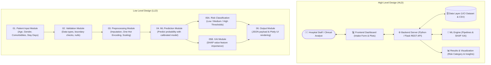
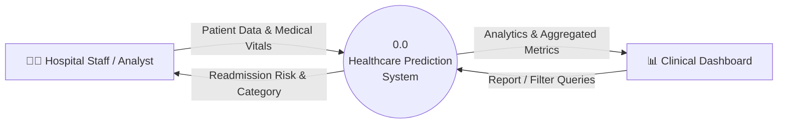
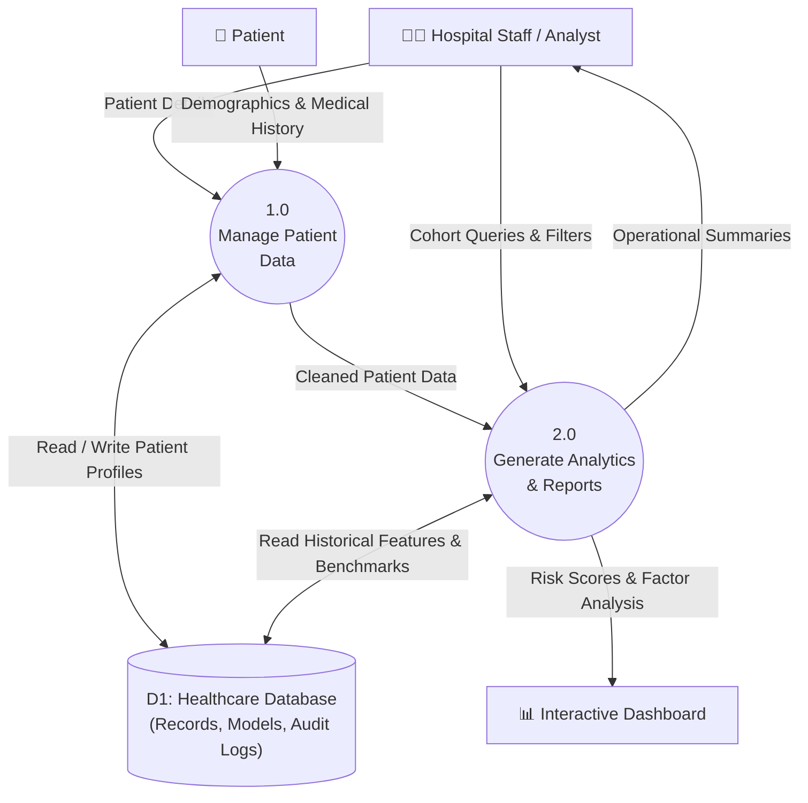

<div align="center">

# 🏥 Patient Health Outcome Predictor (P_025)

### Predictive Clinical Intelligence & Patient Risk Stratification Powered by Machine Learning

[](https://www.python.org/)
[](https://flask.palletsprojects.com/)
[](https://scikit-learn.org/)
[](https://github.com/slundberg/shap)
[](https://plotly.com/)
[](https://www.hhs.gov/hipaa/index.html)

**Project Track:** Business Analytics | Healthcare & Pharma  
**Team Name:** Never-Mind  
**Team Member:** Nandani Kumari  

[Repository](https://github.com/srivastavanandani190-lang/Patient-Health-Outcome-Predictor) • [Project Overview](#-problem-statement--solution) • [System Architecture](#-system-architecture) • [Data Flow (DFD)](#-data-flow-diagrams-dfd) • [Tech Stack](#-technology-stack) • [Quick Start](#-quick-start)

---

</div>

## 📌 Executive Summary

**Patient Health Outcome Predictor (Project P_025)** is an end-to-end clinical intelligence system engineered to forecast **30-day hospital readmission risk** from inpatient admission, lab, and demographic data. 

Built with an interpretable machine learning pipeline (scikit-learn + SHAP explainability) and wrapped in a responsive Flask web application, the platform equips healthcare practitioners and clinical analysts with actionable risk stratifications, transparent feature attribution, and population-level comparative insights.

---

## 🎯 Problem Statement & Solution

| The Clinical Challenge | Our Proposed Solution |
| :--- | :--- |
| **Undetected Readmissions:** Hospitals cannot easily flag which discharged patients are at high risk of 30-day post-discharge readmission. | **Predictive Risk Engine:** A trained scikit-learn pipeline embedded within a Flask service that calculates calibrated probability scores from patient intake data. |
| **Black-Box AI Skepticism:** Clinical staff lack an accessible way to understand why a model assigned a specific risk score to a patient. | **Explainable AI (SHAP):** Real-time SHAP (*SHapley Additive exPlanations*) value breakdowns illustrating the exact clinical biomarkers influencing each prediction. |
| **Fragmented Population Visibility:** Macro trends across age, diagnostic groups, and treatment plans are siloed and inaccessible to hospital analysts. | **Interactive Plotly Dashboards:** Dynamic population visualizations enabling cohort filtering and "what-if" treatment scenario comparisons. |

---

## 🏗️️ System Architecture

### High Level Design (HLD) vs. Low Level Design (LLD)



---

## 🔄 Data Flow Diagrams (DFD)

### DFD Level 0 (Context Diagram)


### DFD Level 1 (Modular Decomposition)


---

## 💻 Technology Stack

| Layer | Tools & Libraries | Purpose |
| :--- | :--- | :--- |
| **Language** | Python 3.9+ | Primary runtime environment |
| **Data Processing** | `pandas`, `numpy` | Tabular data manipulation, cleaning, and ETL pipelines |
| **Machine Learning** | `scikit-learn`, `joblib` | Model training, cross-validation, and pipeline persistence |
| **Class Imbalance** | `imbalanced-learn` (SMOTE) | Handling skewed readmission distributions in clinical data |
| **Explainable AI** | `SHAP` | Computing localized Shapley values for factor transparency |
| **Backend & Web API** | `Flask`, `gunicorn` | Lightweight web service and REST endpoints |
| **Frontend UI** | HTML5, Jinja2, CSS3 | Clean, responsive patient intake and report pages |
| **Analytics Dashboards** | `Plotly`, Streamlit | Dynamic charting (donut distributions, cohort comparisons) |
| **Datasets** | UCI 130-US Hospitals (1999–2008), Synthea | Primary clinical readmission benchmarks and synthetic test suites |

---

## 🚀 Key Features

* **30-Day Readmission Risk Scoring:** Instant classification into configurable risk bands (`Low`, `Moderate`, `High`).
* **SHAP Explainability View:** Breaks down every clinical factor (e.g., number of lab procedures, prior admissions, insulin treatment) contributing to an individual patient's score.
* **Batch CSV Upload:** Enables hospital analysts to upload batch patient records and automatically generate aggregated risk summaries.
* **"What-If" Scenario Simulator:** Allows clinicians to simulate alterations in care plans (e.g., adjusting length of stay or post-discharge monitoring) to see real-time risk adjustments.
* **Privacy by Design:** Architected to run exclusively on de-identified and synthetic datasets, adhering to HIPAA and GDPR governance principles.

---

## 📂 Project Directory Structure

```text
Patient-Health-Outcome-Predictor/
├── data/
│   ├── raw/                     # Original de-identified UCI dataset
│   └── processed/               # Cleaned & feature-engineered datasets
├── models/
│   ├── model.joblib             # Serialized trained scikit-learn pipeline
│   └── preprocessor.joblib      # Feature encoders and transformers
├── static/
│   ├── css/                     # Application styling
│   └── js/                      # Frontend interaction scripts
├── templates/
│   ├── index.html               # Main dashboard & analytics view
│   ├── predict.html             # Patient intake form & risk results
│   └── reports.html             # Cohort analysis & population trends
├── app.py                       # Flask application entry point & API routes
├── pipeline.py                  # Model training, SMOTE balancing & evaluation
├── explainability.py            # SHAP value generation module
├── requirements.txt             # Python dependencies
└── README.md                    # Project documentation
```

---

## ⚡ Quick Start

### 1. Clone the Repository
```bash
git clone https://github.com/srivastavanandani190-lang/Patient-Health-Outcome-Predictor.git
cd Patient-Health-Outcome-Predictor
```

### 2. Set Up Virtual Environment
```bash
# Windows
python -m venv venv
venv\Scripts\activate

# macOS / Linux
python3 -m venv venv
source venv/bin/activate
```

### 3. Install Dependencies
```bash
pip install --upgrade pip
pip install -r requirements.txt
```

### 4. Run the Application
```bash
python app.py
```
Open your browser and navigate to `http://localhost:5000`.

---

## 📊 Benchmark Dataset & Performance

* **Primary Source:** [Diabetes 130-US Hospitals Dataset (1999–2008)](https://archive.ics.uci.edu/dataset/296/diabetes+130-us+hospitals+for+years+1999-2008), UCI Machine Learning Repository.
* **Cohort Size:** 69,975+ unique clinical encounters.
* **Key Targets:** 30-day readmission status (`<30`, `>30`, `NO`).
* **Preprocessing:** Median imputation for continuous metrics, one-hot encoding for categorical variables, and SMOTE for minority class balancing.

---

## 👥 Project Team

* **Team Name:** Never-Mind
* **Lead Developer & Analyst:** Nandani Kumari ([@srivastavanandani190-lang](https://github.com/srivastavanandani190-lang))
* **Project ID:** P_025
* **Domain:** Business Analytics — Healthcare & Pharma

---

## 📄 License & Compliance

This project is developed for academic and predictive analytics demonstration purposes under Project **P_025**. It uses open-source and synthetic data complying with HIPAA de-identification requirements.
